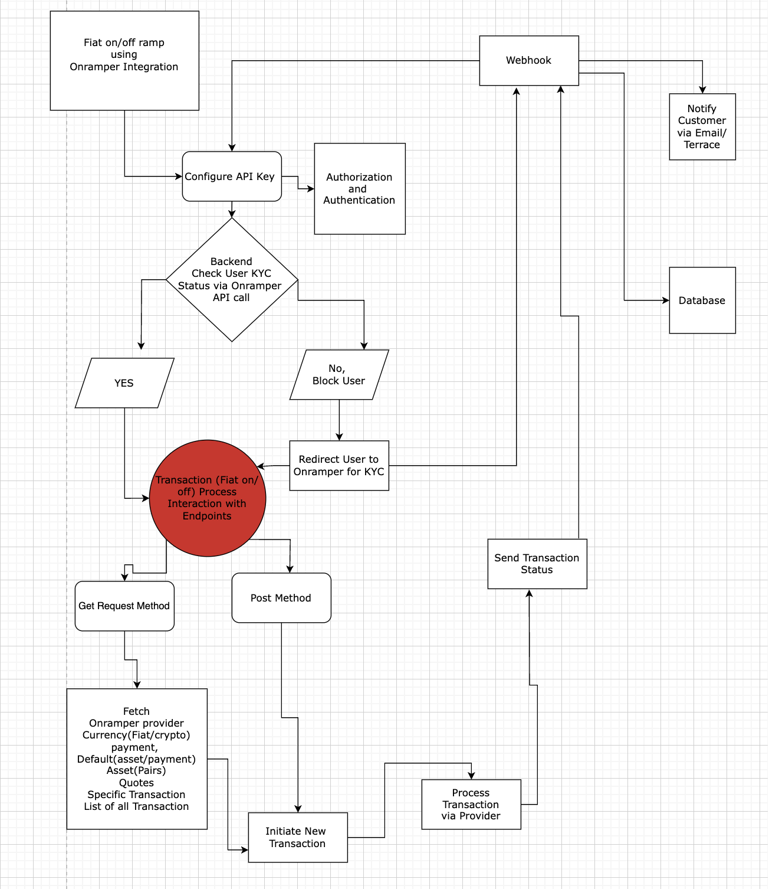

# Fiat On/Off Ramp Technical Requirements Document (TRD)

Author: John Paul Nwaekwu
Approvers: Nik Ogura
Status: In review

# **Table of Contents**

1. Objective
2. Link to Product Requirement Documentation (PRD)
3. Required Micro-Services
    - Existing Micro-Services
    - New Micro-Services
4. Requirements
    - Functional Requirements
    - Non-Functional Requirements
5. Implementation Plan
    - Implementation Strategy
    - API Design
    - Architecture Diagram
    - Database Change
    - Implementation Timeline
    - Data Integrity
    - Data Reporting
    - Scalability Concerns
    - Versioning Strategy
    - Testing Strategy
    - Scope Planning
    - Release Strategy
6. References

---

## **1. Objective**

The objective of this project is to integrate a **Fiat On/Off Ramp** service into the Terrace platform, allowing users to deposit and withdraw fiat currency (e.g., USD, EUR) seamlessly using a third-party provider.

### **1.1 Integration Objective**

The integration of the **Onramper API** into the Terrace platform aims to:

- Enable users to deposit and withdraw fiat seamlessly.
- Synchronize KYC approval from the Onramper provider with Terrace KYC.
- Integrate fiat transactions into transaction history.
- Ensure compliance with regulatory standards for fiat transactions.

---

## **2. Link to Product Requirement Documentation (PRD)**

The PRD provides the business objectives and high-level user requirements for integrating a **Fiat On/Off Ramp** into Terrace. For details, refer to:

[Fiat On/Off Ramp PRD](https://www.notion.so/PRD-Fiat-on-off-Ramps-161ecc4d7e59809d8b8cd49603112a84?pvs=21)

---

## **3. Required Micro-Services**

### **3.1 Existing Micro-Services**

- The API service: Handles **user authentication** (sign-up and sign-in) and manages **user profile details**.

### **3.2 New Micro-Services**

- **Fiat On/Off Ramp Service**: A microservice to interface with the Onramper API for processing fiat deposits and withdrawals. **Backend Services in Golang** (Handles transaction processing & webhooks)

---

## **4. Requirements**

### **4.1 Functional Requirements**

| **Requirement ID** | **Description** | **Priority** |
| --- | --- | --- |
| FR-1 | Integrate with Onramper API for fiat deposits and withdrawals. | High |
| FR-2 | Synchronize KYC status from Onramper to Terrace. | High |
| FR-3 | Block fiat transactions until KYC verification is complete. | Medium |
| FR-4 | Log fiat transactions into the user’s transaction history. | High |
| FR-5 | Ensure seamless frontend integration for user interaction. | High |

### **4.2 Non-Functional Requirements**

| **Requirement ID** | **Description** | **Priority** |
| --- | --- | --- |
| NFR-1 | Ensure 99.9% system availability for fiat transactions. | High |
| NFR-2 | Ensure verification pop-up and success sync latency is ≤10 seconds. | High |
| NFR-3 | Support up to 250 concurrent users. | High |
| NFR-4 | Ensure compliance with financial regulatory standards. | High |
| NFR-5 | Secure API communication with encrypted data transfer. | High |

---

## **5. Implementation Plan**

### **5.1 Implementation Strategy**

1. **Core API Integration:** Implement the connection between Terrace and Onramper API.
2. **Frontend Updates:** Modify deposit and withdrawal UI to accommodate fiat transactions.
3. **Transaction History Logging:** Ensure all fiat transactions are recorded in the database.
4. **KYC Synchronisation:** Implement an automatic sync between Onramper KYC and Terrace KYC. Onramper's KYC is more stringent than Terrace's KYC, so we can accept Onramper's KYC in lieu of our own.  If Onramper's KYC and Terrace's KYC ever disagree, the user must be suspended, transactions prevented, etc. Can we get full user info from Onramper's KYC? Or will we only get a boolean?
5. **Testing & Deployment:** Perform integration testing before production rollout.

### **5.2 Architecture Diagram**

### **5.3 Database Change**

| **Change** | **Details** |
| --- | --- |
| Add fiat transactions table | Track user fiat deposits/withdrawals |
| Modify user table | Store Onramper KYC status |

### **5.4 Implementation Timeline**

| **Milestone** | **Description** | **Deadline** |
| --- | --- | --- |
| API Integration | Connect to Onramper API | [Date] |
| Frontend Updates | UI for fiat transactions | [Date] |
| Backend Updates | Transaction logging & KYC sync | [Date] |
| Testing & QA | Validate end-to-end flow | [Date] |
| Production Rollout | Deploy feature to users | [Date] |

### **5.5 Data Integrity**

| **Category** | **Description** |
| --- | --- |
| Transaction Consistency | Ensure all transactions are logged correctly. |
| KYC Sync | Ensure user status updates accurately reflect Onramper KYC. |
| API Latency | Ensure API calls remain within acceptable latency thresholds. |

### **5.6 Data Reporting**

| **Metric Name** | **Type** | **Description** |
| --- | --- | --- |
| FiatTransactionsTotal | Counter | Total number of fiat transactions processed. |
| KYCVerificationSuccess | Counter | Total number of successful KYC verifications. |
| FiatTransactionLatency | Histogram | Latency of fiat transaction processing. |

### **5.7 Scalability Concerns**

- The system should scale to accommodate increasing transaction volume.
- API rate limits from Onramper should be considered.
- Database indexing should be optimized for transaction logging.

### **5.8 Versioning Strategy**

- Initial release will be **v1.0**.
- Future iterations may include additional fiat providers.

### **5.9 Testing Strategy**

| **Testing Type** | **Description** |
| --- | --- |
| Unit Testing | Validate API interactions and business logic. |
| Integration Testing | Ensure seamless communication with Onramper. |
| Load Testing | Test system performance under high transaction load. |

### **5.10 Scope Planning**

- Estimate 3 sprints for API and frontend implementation.
- Additional sprint for testing and refinements.

### **5.11 Release Strategy**

- **Beta Testing**: Small user cohort for initial feedback.
- **Full Rollout**: Deploy to all users after successful beta testing.

---

## **6. References**

- [Onramper API Documentation](https://onramper.com/api)
- [Product Requirement Documentation](https://www.notion.so/PRD-Fiat-on-off-Ramps-161ecc4d7e59809d8b8cd49603112a84?pvs=21)

---